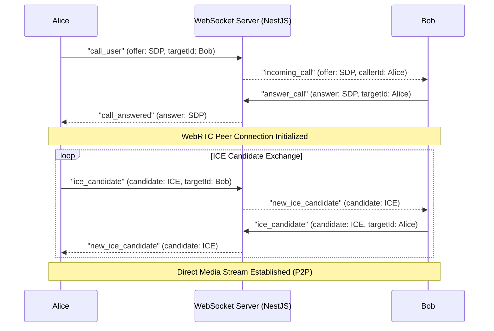

# AI Algorithms & WebRTC Signaling - Instagram NextGen Clone (2026 Version)

This document covers the TikTok-level Reels recommendation algorithm, user collaborative recommendation calculations, and WebRTC peer-to-peer signalling routines.

---

## 1. Reels Feed Ranking Formula

To keep users engaged, we score potential reels for user $u$ on reel $r$ using the following multi-objective scoring formula:

$$\text{Score}(u, r) = w_1 \cdot P(\text{Like}_{u,r}) + w_2 \cdot P(\text{Comment}_{u,r}) + w_3 \cdot P(\text{Share}_{u,r}) + w_4 \cdot \text{WatchTimeRatio}_{u,r} - w_5 \cdot \text{RecencyPenalty}_r$$

### Variables Explanation
- $P(\text{Like}_{u,r}), P(\text{Comment}_{u,r}), P(\text{Share}_{u,r})$: Probabilities derived from User and Reel embeddings using cosine similarity.
- $\text{WatchTimeRatio}$: Percentage of reel length watched (e.g., $1.5$ if watched 1.5 times, capping at $3.0$).
- $\text{RecencyPenalty}$: $\lambda \cdot \log(\Delta t)$, where $\Delta t$ is time elapsed since publishing (in hours). Prevents feed stagnation.

### Real-Time Pipeline
```
[User Action: Swipe] 
       │
       ▼
[Kafka Event "reel.watch"] 
       │
       ▼
[Consumer recalculates user interest clusters] 
       │
       ▼
[Update Redis sorted set: ZADD feed:reels:userId <Score> <ReelId>]
```

---

## 2. Collaborative Filtering & Content Search

To recommend creators, the system evaluates user-user similarity maps using Singular Value Decomposition (SVD) and Content Vector Embeddings from post captions using a pre-trained sentence Transformer:

$$\text{Similarity}(A, B) = \frac{\mathbf{v}_A \cdot \mathbf{v}_B}{\|\mathbf{v}_A\| \|\mathbf{v}_B\|}$$

These operations run asynchronously using Python AI engines or Node.js PyTorch libraries, feeding similarity indices into an ElasticSearch vector database.

---

## 3. WebRTC Call Flow (HD Voice & Video)

Below is the standard connection signaling path for WebRTC between Caller (Alice) and Callee (Bob) via our NestJS socket signaling server.


