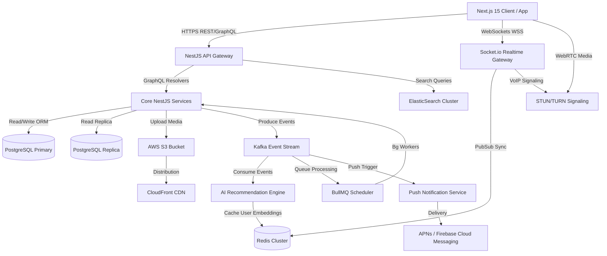
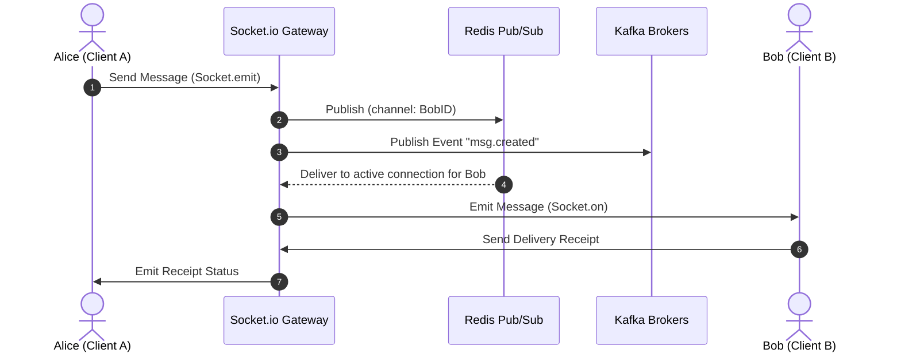

# System Architecture - Instagram NextGen Clone (2026 Version)

This document details the high-level system architecture, microservice boundaries, data flow routes, and technical designs for the Instagram NextGen Clone.

---

## 1. High-Level Architecture Diagram

---

## 2. Microservice Boundaries

The system is split into specialized sub-modules to achieve target scalability of **100M+ Monthly Active Users** and **10M+ Concurrent Users**:

1. **Authentication Service**: Handled via JWT, OAuth2, Passkeys, and multi-device session mapping on Redis.
2. **Feed & Post Service**: Uses read-replica database pools to serve post requests in under 1s.
3. **Reels Engine**: Personalized scroll feed powered by collaborative filtering scores loaded into Redis.
4. **Chat & WebRTC Signaling Service**: State synchronization using Socket.io and Redis adapters, carrying WebRTC audio/video connections over TURN nodes.
5. **AI Moderation & Recommendation**: Asynchronous pipelines evaluating posts for NSFW metrics (using YOLOv8 models) and generating embeddings for similarity feeds.
6. **Notification Engine**: High-throughput Kafka pipeline broadcasting likes, comments, and live-streams within 50ms.

---

## 3. Real-Time Message Flow (1-to-1 DMs)

---

## 4. Key Performance Strategies

- **Video Preloading**: Reels vertical navigation fetches a sliding window of metadata (current + next 3 reels) to maintain <200ms start-up.
- **Edge Cache Optimization**: S3 images/videos are transformed by CloudFront media processors dynamically based on viewport.
- **Connection Multiplexing**: Redis Adapter keeps Socket.io active connections distributed across multiple Node.js scaling groups.
